# IT Asset Manager（IT 固定资产管理系统）

[English](#english) | [中文](#中文)

---

<a id="中文"></a>

制造业企业内网 IT 固定资产全生命周期管理平台：**台账管理 → 维修工单 → 扫码盘点 → 折旧与 AI 经济寿命分析 → 报废预测**，另含 PDA 无线定位（SNMP/AC 采集）与车间投屏数据大屏。

> 本仓库为内网自研系统的开源发布版，**不含任何真实业务数据**。附一条命令即可生成的仿真演示数据集。

## 系统预览

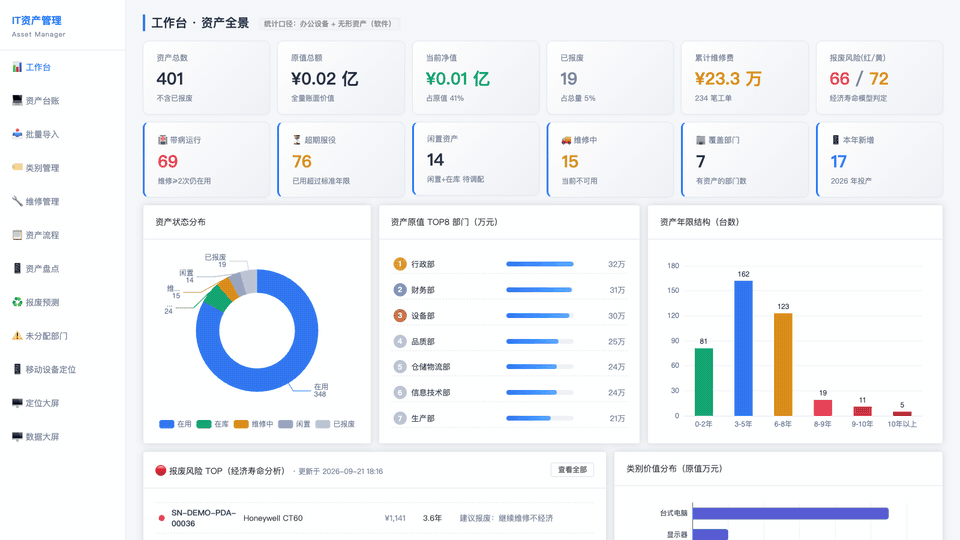

*工作台 / 台账 / 报废预测 / 盘点 / 流程 / 设备定位 / 数据大屏 全景漫游*


*车间投屏数据大屏（实时时钟 + 图表动画）*

### 截图

| 工作台 | 数据大屏 |
|--------|----------|
| 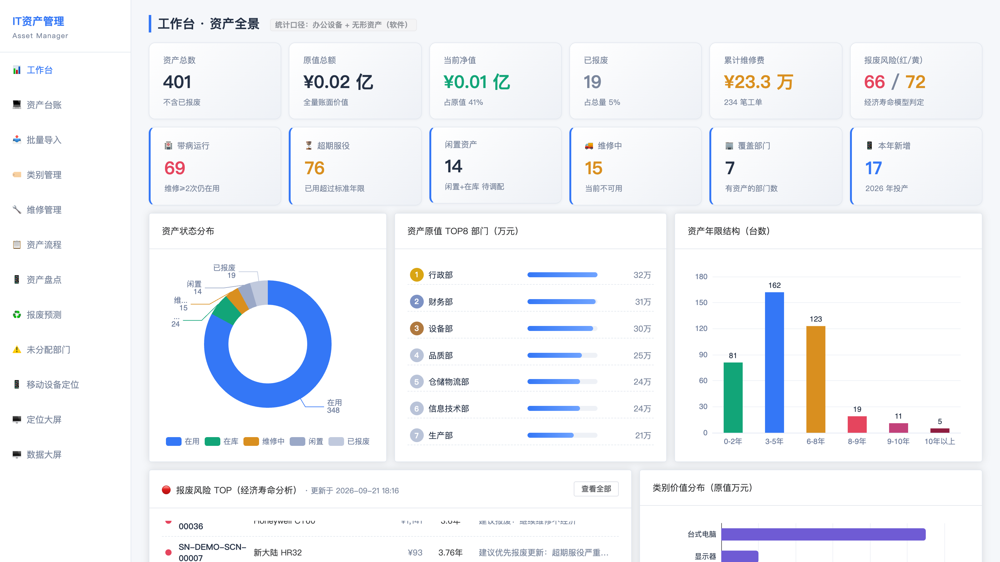 | 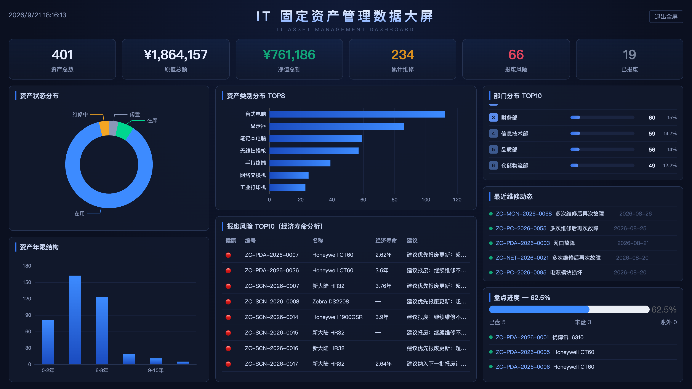 |

| 报废预测 · 经济寿命分析 | 资产台账 |
|--------------------------|----------|
| 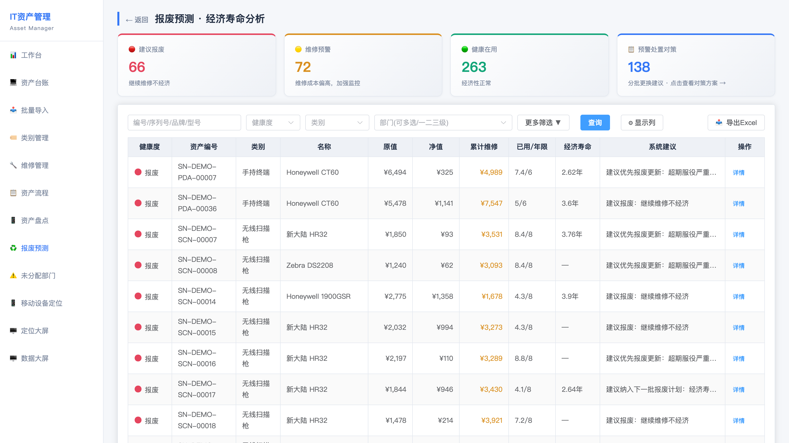 | 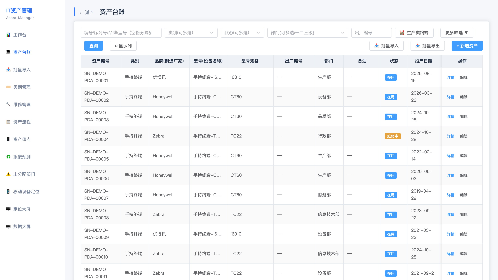 |

| 移动设备定位 | 定位大屏 |
|--------------|----------|
| 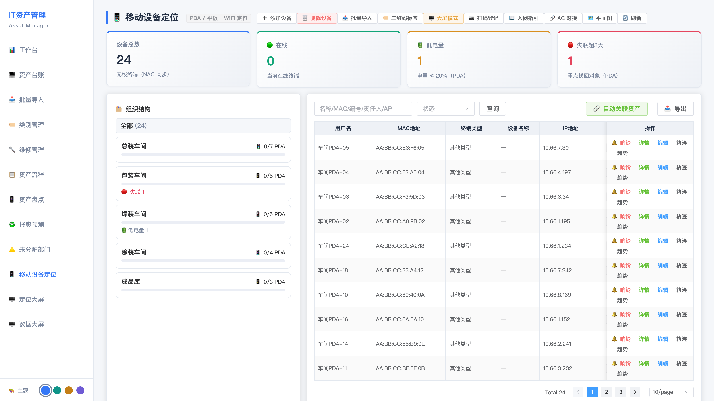 | 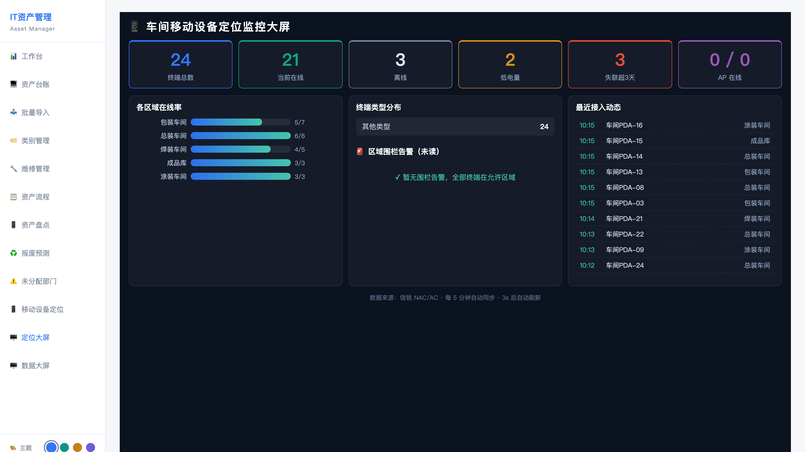 |

<details>
<summary>更多截图</summary>

| 登录 | 维修管理 |
|------|----------|
| 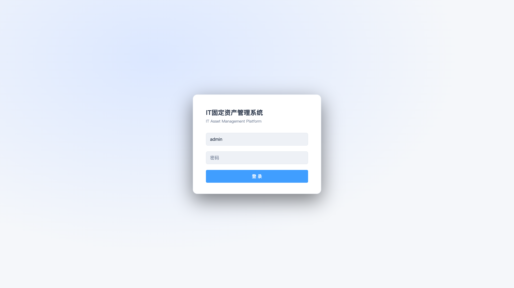 | 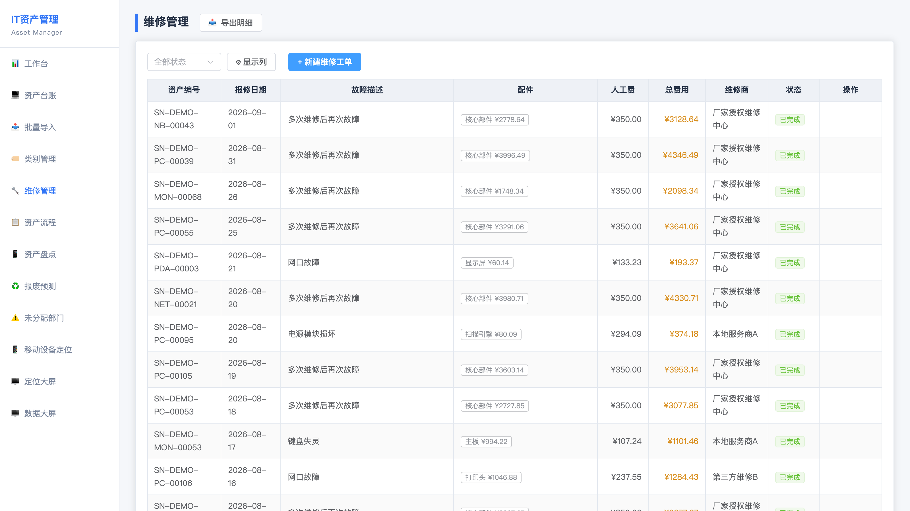 |

| 资产盘点 | 资产流程 |
|----------|----------|
| 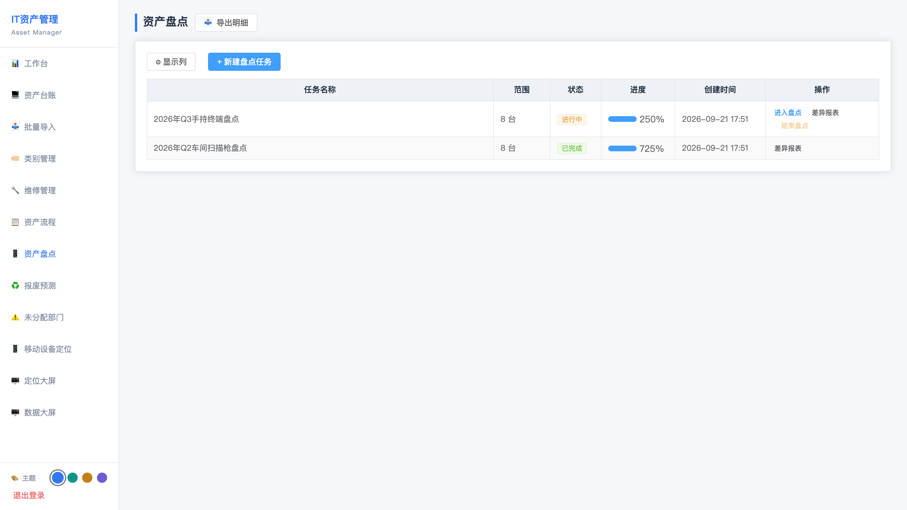 | 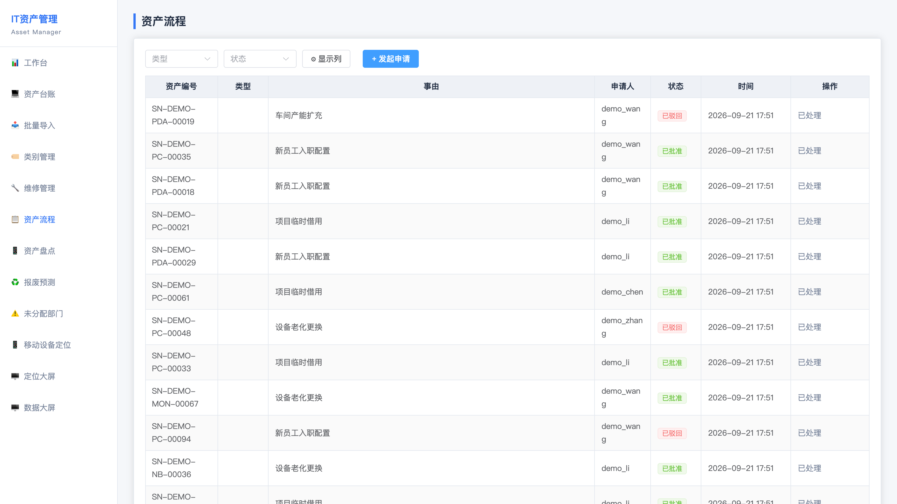 |

</details>

## 功能特性

- **资产台账**：终端/平板/扫描枪/打印头/台式机/显示器/网络设备等全品类；Excel 批量导入（校验 + 错误行留痕）；自定义字段引擎（类别级 schema，加字段不改表）
- **经济寿命分析（核心差异化）**：直线折旧 + 维修成本低劣化模型；红黄绿健康度；「修不如换 / 建议报废」规则引擎；可接 Ollama 本地大模型生成中文分析报告（失败自动降级模板文案）
- **维修工单**：配件明细 JSON、费用累计，完成后自动写全流程留痕
- **扫码盘点**：任务圈定 → PDA/手机 H5 扫码 → 差异报表（盘盈 / 盘亏）
- **资产流程**：领用 / 调拨 / 归还审批流
- **PDA 无线定位**：MAC 心跳上报 + 信锐 AC(SNMP) / NAC 登录采集 + 华为 AC(SSH) 采集、地图打点、远程响铃（MQTT）
- **数据大屏**：ECharts 深色投屏页（构成 / 年限分布 / 维修统计 / 盘点进度 / 报废风险 TOP10）
- **权限**：JWT 认证、Django Admin 后台

## 技术栈

| 层 | 选型 |
|----|------|
| 后端 | Django 3.2 LTS + DRF + SimpleJWT |
| 数据库 | SQLite（独立库，零配置起步）/ PostgreSQL 可平移 |
| 前端 | Vue 3 + Element Plus + ECharts + Vite |
| AI | Ollama（可选，仅生成文字，规则引擎不依赖 AI） |
| 部署 | Docker（python:3.6-slim + 离线 wheels，适配隔离内网） |

## 快速开始

### Docker（推荐）

```bash
git clone https://github.com/tomlen045/asset-manager.git
cd asset-manager
cp .env.example .env       # 修改 DJANGO_SECRET_KEY 与 PDA_HEARTBEAT_TOKEN
docker compose up -d --build
# 浏览器访问 http://localhost:8091  初始账号 admin / admin123（登录后立即改密）
```

> Docker Hub 不可达的隔离内网：提前导入 `python:3.6-slim` 镜像即可；Dockerfile 依赖离线 wheels，先在联网机器按 `deploy/Dockerfile` 内的版本清单 `pip download` 到 `deploy/wheels/`。

### 本地开发 + 演示数据

```bash
# 后端
cd backend
python -m venv .venv && source .venv/bin/activate
pip install django djangorestframework djangorestframework-simplejwt django-cors-headers openpyxl
python manage.py migrate
python scripts/seed_demo.py        # ← 灌入仿真演示数据（420台资产/维修单/盘点/PDA，全部合成数据）
python manage.py runserver 8091

# 前端
cd frontend
npm install && npm run dev
# 打开 vite 输出的地址，账号 admin / admin123
```

`seed_demo.py` 生成的全部是**合成演示数据**（序列号 `SN-DEMO-*`、合成 MAC、通用设备型号），可用于培训、测试与界面演示。

## 目录结构

```
├── backend/            # Django 后端（accounts 认证 / assets 业务）
│   ├── config/         # settings / urls（开发 + 生产两套）
│   ├── assets/         # 台账、工单、盘点、经济分析、大屏、PDA
│   └── scripts/        # seed_demo.py 演示数据 + 设备侧采集脚本（SNMP/SSH/NAC）
├── frontend/           # Vue 3 前端源码
├── deploy/             # Dockerfile + 入口脚本
├── docs/               # 截图 / GIF / 设计文档
└── scripts/            # e2e / 冒烟测试脚本
```

## 安全说明

- 所有密钥（SECRET_KEY、PDA Token、初始管理员密码）均从环境变量读取，见 `.env.example`
- 生产环境务必：修改默认密码、设置独立 `DJANGO_SECRET_KEY`、限制 `ALLOWED_HOSTS`、启用 HTTPS
- 历史教训见 `docs/INCIDENT-20260902.md`（批量改 SFC 的事故复盘与防复发铁律）

## License

[MIT](LICENSE)

---

<a id="english"></a>

# IT Asset Management System

Intranet IT asset **full-lifecycle** management platform for manufacturing enterprises: **asset ledger → repair orders → barcode stocktake → depreciation & AI-powered economic-life analysis → scrappage forecast**, plus PDA wireless location tracking (SNMP/AC collectors) and a dark-theme wall dashboard for shop-floor screens.

> This is the open-source release of an in-house system and ships **zero real business data**. A synthetic demo dataset can be seeded with a single command.

## Preview


*Dashboard / ledger / scrappage forecast / stocktake / flows / device location / big screen*


*Shop-floor big screen (live clock + animated charts)*

### Screenshots

| Dashboard | Big Screen |
|-----------|------------|
|  |  |

| Scrappage Forecast | Asset Ledger |
|--------------------|--------------|
|  |  |

## Features

- **Asset ledger** — full-category coverage (handhelds, scanners, printers, desktops, monitors, network gear); Excel bulk import with row-level error reports; category-level custom-field engine (schema-driven, zero migrations)
- **Economic-life analysis (core differentiator)** — straight-line depreciation + maintenance-cost degradation model; red/yellow/green health levels; "repair vs. replace" rule engine; optional Ollama LLM narratives with automatic template fallback
- **Repair orders** — JSON parts detail, cost roll-up, auto lifecycle audit log
- **Barcode stocktake** — scope a task → scan with PDA/phone H5 → variance report (found / missing / unexpected)
- **Asset flows** — assign / transfer / return with approval
- **PDA location** — MAC heartbeat + Sundray AC (SNMP) / NAC collectors + Huawei AC (SSH), floor-map pins, remote ring (MQTT)
- **Big screen** — dark ECharts wall board (composition, age distribution, repair stats, stocktake progress, risk TOP10)
- **Security** — JWT auth, Django admin

## Tech Stack

| Layer | Choice |
|-------|--------|
| Backend | Django 3.2 LTS + DRF + SimpleJWT |
| Database | SQLite (standalone file, zero-config) / PostgreSQL-ready |
| Frontend | Vue 3 + Element Plus + ECharts + Vite |
| AI | Ollama (optional, text generation only) |
| Deploy | Docker (python:3.6-slim + offline wheels for air-gapped intranets) |

## Quick Start

### Docker (recommended)

```bash
git clone https://github.com/tomlen045/asset-manager.git
cd asset-manager
cp .env.example .env       # set DJANGO_SECRET_KEY and PDA_HEARTBEAT_TOKEN
docker compose up -d --build
# open http://localhost:8091 — default admin / admin123 (change immediately)
```

### Local development + demo data

```bash
cd backend
python -m venv .venv && source .venv/bin/activate
pip install django djangorestframework djangorestframework-simplejwt django-cors-headers openpyxl
python manage.py migrate
python scripts/seed_demo.py        # ← synthetic demo data (420 assets, repairs, stocktakes, PDAs)
python manage.py runserver 8091

cd ../frontend
npm install && npm run dev
# default login admin / admin123
```

All seeded records are **synthetic** (`SN-DEMO-*` serials, synthetic MACs, generic device models) — safe for demos, training and screenshots.

## Security notes

- All secrets (SECRET_KEY, PDA token, initial admin password) are read from environment variables — see `.env.example`
- In production: change default credentials, set a unique `DJANGO_SECRET_KEY`, restrict `ALLOWED_HOSTS`, enable HTTPS

## License

[MIT](LICENSE)
